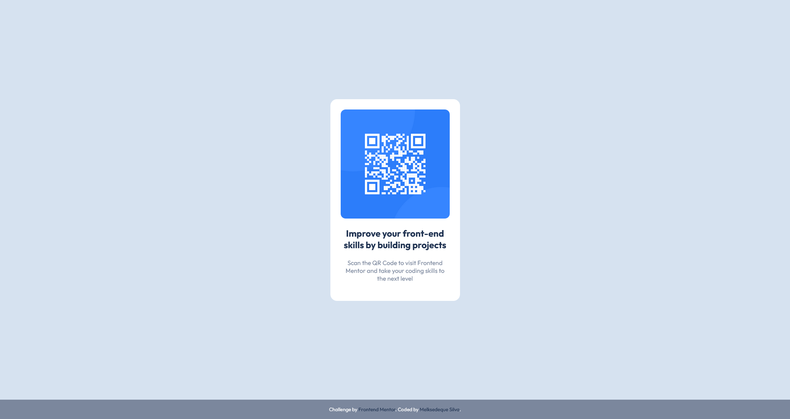
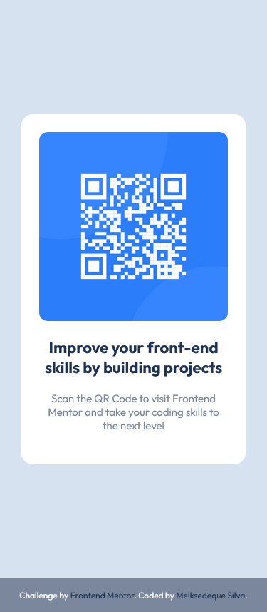

# Frontend Mentor - QR code component solution

This is a solution to the [QR code component challenge on Frontend Mentor](https://www.frontendmentor.io/challenges/qr-code-component-iux_sIO_H). Frontend Mentor challenges help you improve your coding skills by building realistic projects. 

## Table of contents

- [Screenshot](#screenshot)
- [Links](#links)
- [My process](#my-process)
  - [Built with](#built-with)
  - [What I learned](#what-i-learned)
  - [Continued development](#continued-development)
  - [Useful resources](#useful-resources)
- [Author](#author)
- [Acknowledgments](#acknowledgments)

### Screenshot

### Links

- Live Site URL: [Link to Page](https://melksedeque.github.io/qr-code-component/)

## My process

### Built with

- Semantic HTML5 markup
- Sass Compiled
- CSS custom properties
- Google Fonts
- Mobile-first workflow

### What I learned

How to configure SCSS files to compile in one minifyed CSS file.

### Continued development

In future projects I want to focus on JavaScript to improve my development and knowledge in Front-End.

### Useful resources

- [Resource 1](https://www.freecodecamp.org/news/publish-your-website-netlify-github/) - This helped me to configure the GitHub Page and publish this challenge.

- [Resource 2](https://css-tricks.com/snippets/css/a-guide-to-flexbox/) - This is an amazing article which helped me finally understand the Flexbox CSS. Although I haven't used it on this, I recommend it to anyone still learning Flexbox.

- [Resource 3](https://www.boag.online/blog/css-reset) - This helped me to get the CSS Reset of the HTML Elements.

## Author

- Website - [Melksedeque Silva](https://github.com/Melksedeque/)
- Frontend Mentor - [@Melksedeque](https://www.frontendmentor.io/profile/Melksedeque)